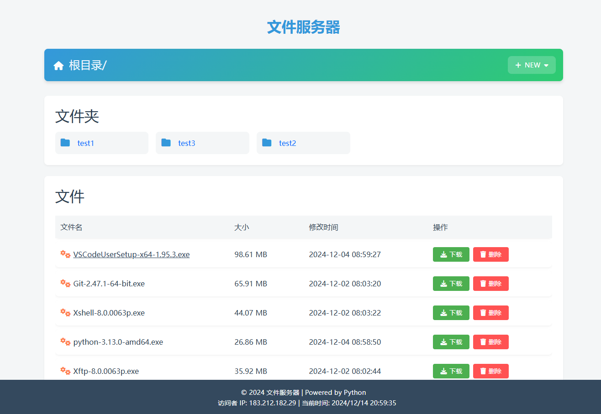

# file_server

#### 介绍
项目是基于Python的简易文件服务器。能以列表的方式展示指定目录的文件和文件夹，同时提供文件下载的功能。

### 效果图

#### 软件架构
Flask架构

#### 使用说明

1. 克隆项目 `git clone https://gitee.com/hityne/file_server.git`
2. 建立Python环境 `pip install -r requirements.txt`
3. 运行 `python app.py /root/files`,其中/root/files替换为需要的路径
4. 访问 `http://127.0.0.1:5000`

